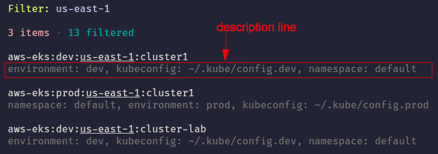
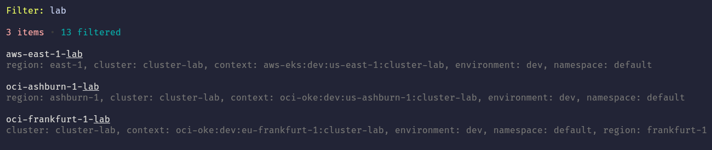

# config.jsonnet


This is the main config file for the `ktx` itself and **all** kubeconfigs together with their contexts. At beginning the content of the file will look similar to:

```jsonnet
(import '.libsonnet') +
{
  //  run "ktx" to open all kube configs
  kube_configs: [
    {
      alias: 'dev', // run "ktx dev" to open only this config
      path: '/home/<user>/.kube/config.dev',
      contexts: std.map(
        function(c) { namespace: 'default', alias: c.name } + c, std.get($.contexts, self.alias, [])
      ),
    },
    {
      alias: 'prod', // run "ktx prod" to open only this config
      path: '/home/<user>/.kube/config.prod',
      contexts: std.map(
        function(c) { namespace: 'default', alias: c.name } + c, std.get($.contexts, self.alias, [])
      ),
    },
  ],
}
```

As you can see, the `kube_configs` is a list of _objects_, where every _object_ represent a single kubeconfig:

```jsonnet
...
    {
      alias: 'dev', // run "ktx dev" to open only this config
      path: '/home/<user>/.kube/config.dev',
      contexts: std.map(
        function(c) { namespace: 'default', alias: c.name } + c, std.get($.contexts, self.alias, [])
      ),
    },
...
```

You can find the details of the three fields `alias`, `path` and `contexts` in the table below.

## Fields

| Field <sub>type</sub>                    | Required | Description                                                                                                                                                                                                                                                                                                                                                                                                                                                                                                                                                                                                                                                                                                                                                                                                                                                                                                                                             |
| ---------------------------------------- | -------- | ------------------------------------------------------------------------------------------------------------------------------------------------------------------------------------------------------------------------------------------------------------------------------------------------------------------------------------------------------------------------------------------------------------------------------------------------------------------------------------------------------------------------------------------------------------------------------------------------------------------------------------------------------------------------------------------------------------------------------------------------------------------------------------------------------------------------------------------------------------------------------------------------------------------------------------------------------- |
| `alias` <sub>string</sub>                | ✅       | Use the `alias` field in the kubeconfig object (`kube_configs.[].alias`) to specify an alias for your kubeconfig file. You can use the `alias` later with the `ktx` command like `ktx <alias>` in order to open only the contexts of the bound kubeconfig.<br><br>When you run `ktx` for the first time, this alias will be generated based on the file extension (without the `.`). In the example above the file name is `config.dev` (see `path: ...`) and the extension is `dev`. As a result the `alias` was set to `dev`. <br><br>You can update this at any time, but you need to **be aware of recreation of the related `context_<alias>.yaml` file**. Means, a new file will be created and the previous `context_<alias>.yaml` will not be renamed, which can cause confusions. For example, when you rename the `alias` from `dev` to `d`, you will have:<br>- `context_d.yaml` - new file<br>- `context_dev.yaml` - still the old file<br> |
| `path` <sub>string</sub>                 | ✅       | This field specifies the absolute path of the kubeconfig file.                                                                                                                                                                                                                                                                                                                                                                                                                                                                                                                                                                                                                                                                                                                                                                                                                                                                                          |
| `contexts`  <sub>array of contexts</sub> |          | Use the `contexts` field to set the default `namespace` and an `alias` per context. In addition you can create extra information you want to show in the _description line_ of the [TUI](../readme.md#tui)<br><br><br><br>In the example above you can see the extra information about the `environment: ...`<br><br>⚠️ Please note, that only the context `name` or `alias` will be used for the filter/fuzzy search.<br>Here comes also the reason of using [Jsonnet](https://jsonnet.org/) for the global configuration. You can generate the `namespace`, `alias` and the extra information based on conditions and functions (see [Examples](#examples) below)                                                                                                                                                                                                                                                   |

---

## Examples

In the config example above, you can see already two [Jsonnet functions](https://jsonnet.org/ref/stdlib.html) in the `contexts: ...` field of the kubeconfig _object_:

```jsonnet
(import '.libsonnet') +
{
  kube_configs: [
    {
      alias: 'dev',
      ...
      contexts: std.map(
        function(c) { namespace: 'default', alias: c.name } + c, std.get($.contexts, self.alias, [])
      ),
    },
    ...
  ]
}
```

The `std.get()` function returns the contexts of the current kubeconfig given by its alias (`self.alias`). Or it returns an empty list (`[]`), if no kubeconfig with the give alias exists.
The `$.contexts` is hidden behind the `(import '.libsonnet') +` in the first line.

The `std.map()` function takes the output of the `std.get()` function and applies the `function(c) ...`  to each element of the array. In our case, `c` is the individual context
_object_ and we just apply `{namespace: 'default', alias: c.name}`. As a result the namespace for every context will be set to the `default` namespace and the `alias` is
equal to the original context name (`c.name`).

Now we could also add more logic to the config in order to set the `namespace` or the `alias` based on the original context name.

### Define Context Aliases

**Scenario:** The names of the kube contexts are autogenerated by another script, provided by another team. You don't want to change these names in your local kubeconfig,
because of possible updates in the future. Instead you want to use _aliases_, managed outside of your kubeconfig files.

The goal is to shorten quite long context names and to store the result as aliases. Shorter aliases will save us some keystrokes later and can also be faster filtered.

#### Manually Via `contexts_<alias>.yaml` File

You could now start to create individual aliases within the `contexts_<alias>.yaml` file for the specific kubeconfig, like:

```yaml
# contexts_dev.yaml

- alias: aws-eks:dev:eu-central-1:cluster1  # <----- just rename this
  kubeconfig: ~/.kube/config.dev
  name: aws-eks:dev:eu-central-1:cluster1
  namespace: default
- alias: aws-eks:dev:us-east-1:cluster-lab  # <----- and here too
  kubeconfig: ~/.kube/config.dev
  name: aws-eks:dev:us-east-1:cluster-lab
  namespace: default
  ...
```

#### Generated Based On Patterns

In our [example kubeconfig files](examples/) we are using context names, like:
- `aws-eks:dev:us-east-1:cluster-lab`
- `aws-eks:dev:eu-central-1:cluster1`
- `oci-oke:prod:us-ashburn-1:cluster1`

The pattern of these _original context names_ is:

`[cloud-platform]:[environment]:[region]:[cluster]`

Means, we could create a small Jsonnet function to:
1. split the _original context name_
2. reduces the content of the items
3. rearrange the reduced parts
4. merge everything together to form the new alias

As an outcome, the aliases for the examples above will look like these:

| context name | context alias | 
| -------------| ------------- |
| `aws-eks:dev:us-east-1:cluster-lab` | `aws-east-1-lab` |
| `aws-eks:dev:eu-central-1:cluster1` | `aws-central-1-d` |
| `oci-oke:prod:us-ashburn-1:cluster1` | `oci-ashburn-1-p` |

The function could look like this:

```jsonnet
// generate an alias for a context name expecting the pattern:
// [cloud-platform]:[environment]:[region]:[cluster]
local alias(name) =
  local parts = std.split(name, ':');
  local cloud = std.split(parts[0], '-')[0];  // take only the cloud provider
  local environment = parts[1][0];  // take only the first letter, like d or p
  local region = std.splitLimit(parts[2], '-', 1)[1];  // remove the country; "us", "eu", "ap" ...
  // we want to have either the environment or in case of a "lab" cluster just the word "lab"
  local clusterOrEnv = if std.endsWith(parts[3], 'lab') then 'lab' else environment;

  '%s-%s-%s' % [cloud, region, clusterOrEnv];
```

This function can be then used like:

```jsonnet
...
    {
      ...
      contexts: std.map(
        function(c) { namespace: 'default', alias: alias(c.name) } + c, std.get($.contexts, self.alias, [])
      ),
    },
...
```

<details>
  <summary>Complete Example: ...</summary>

```jsonnet
// generate an alias for a context name expecting the pattern:
// [cloud-platform]:[environment]:[region]:[cluster]
local alias(name) =
  local parts = std.split(name, ':');
  local cloud = std.split(parts[0], '-')[0];  // take only the cloud provider
  local environment = parts[1][0];  // take only the first letter, like d or p
  local region = std.splitLimit(parts[2], '-', 1)[1];  // remove the country; "us", "eu", "ap" ...
  // we want to have either the environment or in case of a "lab" cluster just the word "lab"
  local clusterOrEnv = if std.endsWith(parts[3], 'lab') then 'lab' else environment;

  '%s-%s-%s' % [cloud, region, clusterOrEnv];

(import '.libsonnet') +
{
  //  run "ktx" to open all kube configs
  kube_configs: [
    {
      alias: 'dev',  // run "ktx dev" to open only this config
      path: '/home/<user>/.kube/config.dev',
      contexts: std.map(
        function(c) { namespace: 'default', alias: alias(c.name) } + c, std.get($.contexts, self.alias, [])
      ),
    },
    {
      alias: 'prod',  // run "ktx prod" to open only this config
      path: '/home/<user>/.kube/config.prod',
      contexts: std.map(
        function(c) { namespace: 'default', alias: alias(c.name) } + c, std.get($.contexts, self.alias, [])
      ),
    },
  ],
}
```

</details>

### Add More Description Fields

**Scenario:** As we have now an alias with the shortened parts, it also still useful to have the _original context name_ visible in the _description line_ of the [TUI](../readme.md#tui). In addition we could also add for example the `environment`.

#### Manually Via `contexts_<alias>.yaml` File

Again, you could directly change everything in the specific `contexts_<alias>.yaml` file. You may have already seen, that the `name: ...` field already contains the _original context name_. This is caused by the `ktx` tool itself to map the right context independently from any user settings. But as it is maybe not required by the user, the `name` field is hidden per default. The easiest solution here is to create another field like `context: ` and store the value of the `name` field there with the help of [yaml anchors](https://support.atlassian.com/bitbucket-cloud/docs/yaml-anchors/) — be aware of the fact, that anchors will be replaced later on by the `ktx` tool. All other extra fields can be just added, like:

```yaml
# contexts_dev.yaml

- alias: aws-central-1-d
  kubeconfig: ~/.kube/config.dev
  name: &name aws-eks:dev:eu-central-1:cluster1 # <--- set anchor: &name
  context: *name                                # <--- use anchor: *name
  namespace: default
  environment: dev                              # <--- extra field 'environment'
- alias: aws-east-1-lab
  kubeconfig: ~/.kube/config.dev
  name: &name aws-eks:dev:us-east-1:cluster-lab
  context: *name
  namespace: default
  environment: dev
  ...
```

#### Generated Based On Patterns

Doing it manually can become a time consuming and repeatable task. So, instead, you could also use some Jsonnet code. 
Therefore we could rewrite the function to generate the aliases from the example above:

```jsonnet
// generate an alias and other fields for a context
local fieldsFrom(ctx) =
  // expected name pattern: [cloud-platform]:[environment]:[region]:[cluster]
  local name = ctx.name;
  local parts = std.split(name, ':');
  local cloud = std.split(parts[0], '-')[0];  // take only the cloud provider
  local environment = parts[1][0];  // take only the first letter, like d or p
  local region = std.splitLimit(parts[2], '-', 1)[1];  // remove the country; "us", "eu", "ap" ...
  // we want to have either the environment or in case of a "lab" cluster just the word "lab"
  local clusterOrEnv = if std.endsWith(parts[3], 'lab') then 'lab' else environment;
  ctx {
    context: ctx.name,
    alias: '%s-%s-%s' % [cloud, region, clusterOrEnv],
    environment: parts[1],
    region: region,
    cluster: parts[3],
    namespace: 'default',
  };

```

The function was renamed from `alias(name)` to `fieldsFrom(ctx)`. As you can see the function takes now the whole context (short `ctx`) as input and also returns a complete context _object_ instead of a single string.

The usage of the function turned into:

```jsonnet
...
    {
      ...
      contexts: std.map(
        function(c) fieldsFrom(c), std.get($.contexts, self.alias, [])
      ),
    },
...
```

<details>
  <summary>Complete Example: ...</summary>

```jsonnet
// generate an alias and other fields for a context
local fieldsFrom(ctx) =
  // expected name pattern: [cloud-platform]:[environment]:[region]:[cluster]
  local name = ctx.name;
  local parts = std.split(name, ':');
  local cloud = std.split(parts[0], '-')[0];  // take only the cloud provider
  local environment = parts[1][0];  // take only the first letter, like d or p
  local region = std.splitLimit(parts[2], '-', 1)[1];  // remove the country; "us", "eu", "ap" ...
  // we want to have either the environment or in case of a "lab" cluster just the word "lab"
  local clusterOrEnv = if std.endsWith(parts[3], 'lab') then 'lab' else environment;
  ctx {
    context: ctx.name,
    alias: '%s-%s-%s' % [cloud, region, clusterOrEnv],
    environment: parts[1],
    region: region,
    cluster: parts[3],
    namespace: 'default',
  };

(import '.libsonnet') +
{
  //  run "ktx" to open all kube configs
  kube_configs: [
    {
      alias: 'dev',  // run "ktx dev" to open only this config
      path: '/home/<user>/.kube/config.dev',
      contexts: std.map(
        function(c) fieldsFrom(c), std.get($.contexts, self.alias, [])
      ),
    },
    {
      alias: 'prod',  // run "ktx prod" to open only this config
      path: '/home/<user>/.kube/config.prod',
      contexts: std.map(
        function(c) fieldsFrom(c), std.get($.contexts, self.alias, [])
      ),
    },
  ],
}
```

</details>

The result looks like this:


