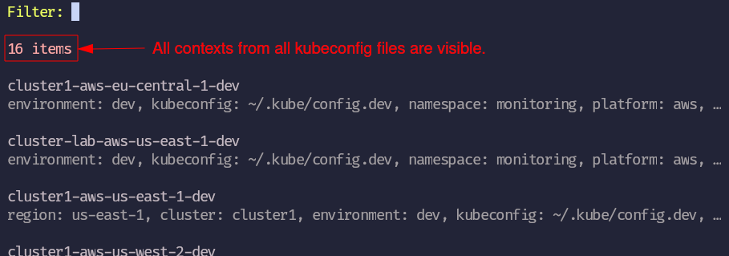
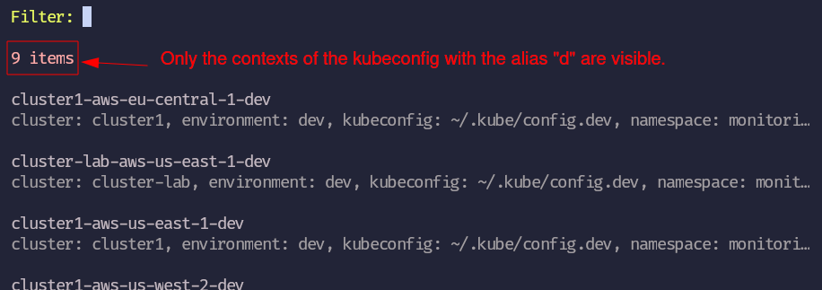
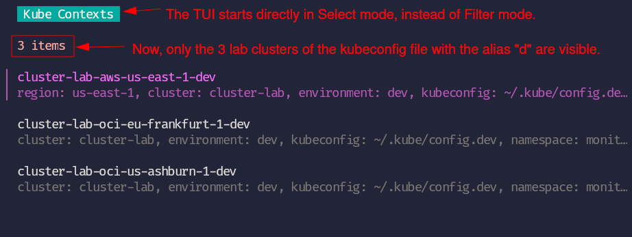

# K8sCtx - Kubernetes Context (Switcher)

**Change your kube context via `ktx` command.**

[](https://goreportcard.com/report/github.com/peterbueschel/k8sctx)
[](https://coveralls.io/github/peterbueschel/k8sctx?branch=main)
[](https://pkg.go.dev/github.com/peterbueschel/k8sctx)


## Features

- support for multiple kubeconfigs (globally - not per terminal session; see [Extras](#extras))
- add aliases for kubeconfig files
- add aliases for the kube contexts
- fuzzy search a context via **T**erminal **U**ser **I**nterface (short [TUI](#tui))
- jump back and forth between two contexts via `ktx -`
- manage your contexts in an extra config file with the help of [Jsonnet](https://jsonnet.org/)
- or manage your contexts in different extra `contexts_<kubeconfig alias>.yaml` files; one per kubeconfig

## Usage

- Opens the [TUI](#tui) in _Filter mode_ with all contexts of all kubeconfig files:

```console
ktx
```



---

- Opens the [TUI](#tui) in _Filter mode_ with all contexts of a kubeconfig file with the alias "`d`":

```console
ktx d
```



---

- Opens the [TUI](#tui) in _Select mode_ with contexts filtered by "lab" of the kubeconfig with the alias "d":

```console
ktx d lab
```



---

- Switches to the previous context _(no TUI involved)_:

```console
ktx -
```

---

- Switches directly to the context with the name/alias "cluster-lab-oci-eu-frankfurt-1-dev" _(no TUI involved)_:

```console
ktx -c cluster-lab-oci-eu-frankfurt-1-dev
```

---

- Returns the current context _(no TUI involved)_:

```console
ktx -c
```

---

## Installation

> [!NOTE]
> Before you run the next command, make sure you have [go](https://go.dev/doc/install) installed.

Run the following command to install the binary on your local machine:

```bash
go install -v github.com/peterbueschel/k8sctx@latest
```

## Configuration

On a first run, the tool will create a folder called `ktx` and the required files inside the user config folder (under Linux it is usually `~/.config/`; under Windows it is `APPDATA`).

> [!NOTE] 
> You can define a different location with the help of the `KTX_CONFIG_DIR` environment variable.

The required files are:

| filename                | content                                   | description |
|-------------------------|-------------------------------------------|-------------|
| `config.jsonnet`        | Settings for `ktx` itself and every context in all kubeconfigs. | The main config file written in [jsonnet](https://jsonnet.org/) for `ktx`, which is also used to update the different `contexts_<alias>.yaml` files.<br><br>🔗 see [config_jsonnet](docs/config_jsonnet.md) for more details. |
| `contexts_<alias>.yaml` | Settings for the contexts of a single kubeconfig. | For every kubeconfig (given by its `<alias>`), such a `.yaml` will be generated. Inside, you can set in turn an alias for each context next to other fields, like `environment` or `region`. These fields will be shown in the [TUI](#tui).<br>Here you could theoretically also specify the default namespace, but it is more recommended to use the `config.jsonnet`.<br><br>⚠️ _If you delete such `.yaml` file, the tool will automatically recreate it with the help of the `config.jsonnet`._ |
| `.libsonnet`            | [Jsonnet](https://jsonnet.org/) code used by the `config.jsonnet` in order to import all `contexts_<alias>.yaml` files. | This is a helper file for the `config.jsonnet`. It makes the content of all `contexts_<alias>.yaml` files available under the alias of the related kubeconfig.<br><br>_This file doesn't need to be touched._ |
| `.state`                | Stores the last & current context, together with the related kubeconfig |  This file is required for the `ktx -` command in order to jump back and forth between two contexts.|

## TUI

The TUI was made with the help of the [charmbracelet/bubbletea](https://github.com/charmbracelet/bubbletea) framework.

It has two modes:
- the _Filter mode_ (using a fuzzy search)
- and the _Select mode_

which are used based on the way you run the `ktx` tool (see [Usage](#usage))


You can switch between the modes by pressing the `esc` key and the `/` key, where:
- pressing `esc` in the _Filter mode_ will enter the _Select mode_
- and pressing the `/` key in the _Select mode_ will return to the _Filter mode_

Depending on your settings, you can filter by either the _name_ of the context or its _alias_.

Leave the TUI without changing the context via `q` in _Select mode_ or directly via `ctrl + c`.


## Extras

### Setup Multiple Kubeconfigs

According to the official [Kubernetes documentation](https://kubernetes.io/docs/tasks/access-application-cluster/configure-access-multiple-clusters/#set-the-kubeconfig-environment-variable):

> The KUBECONFIG environment variable is a list of paths to configuration files. The list is colon-delimited for Linux and Mac, and semicolon-delimited for Windows.


```bash
# Example: Multiple Kube config files - one per environment
export KUBECONFIG="$HOME/.kube/config.lab:$HOME/.kube/config.ed:$HOME/.kube/config.stage:$HOME/.kube/config.live"
```

### Using the `config.jsonnet` file

Please have a look into extra documentation file: [docs/config_jsonnet.md](docs/config_jsonnet.md) 
